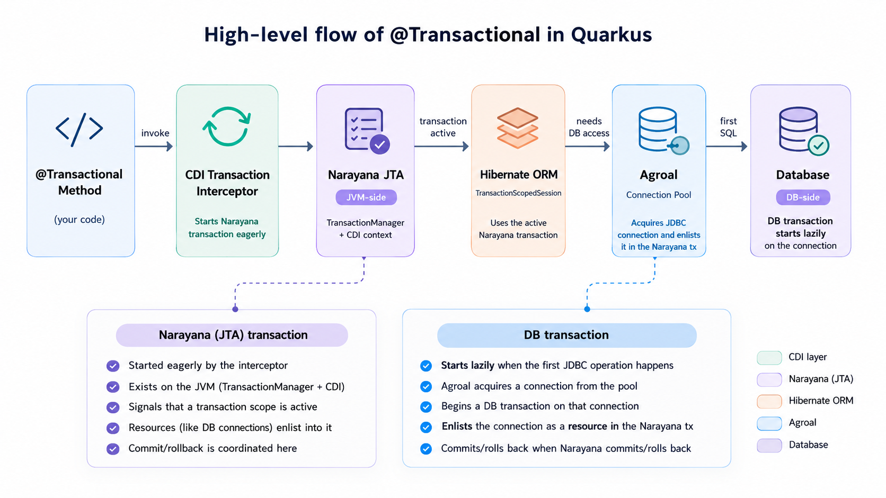

## Introduction

Storing data is one of the most common requirements in software development, 
and at some point you will hit a `TransactionRequiredException` when trying to persist an entity in Quarkus:

```java
public void save(Car car) {
    car.persist();
}
```

The fix is straightforward: add `@Transactional` to your method:

```java
import jakarta.transaction.Transactional;

@Transactional
public void save(Car car) {
    car.persist();
}
```

But understanding *why* it is required and what happens behind the scenes is what separates someone who uses the annotation from someone who truly understands it.

In this article, we will explore how `@Transactional` works in Quarkus and how it integrates with CDI (Contexts and Dependency Injection),
JTA (Jakarta Transactions API), Hibernate ORM and Agroal to manage database operations within a transaction.

### The Jakarta Transactions API

Jakarta EE is built on top of specifications; in turn, Quarkus is built on top of Jakarta EE specifications and community standards.
Each specification defines a set of APIs. I like to say that specifications are like contracts (a big PDF file) that define how things should work,
and the implementations are the actual code that makes things work.
Quarkus uses the [Narayana JTA](https://www.narayana.io) transaction manager as the implementation of the [Jakarta Transactions API](https://jakarta.ee/specifications/transactions/2.0/jakarta-transactions-spec-2.0.pdf) (JTA).

### The Jakarta Contexts and Dependency Injection (CDI)

CDI is also a Jakarta EE specification. It defines how beans are created, managed, and injected into other beans.
Quarkus uses [ArC](https://quarkus.io/guides/cdi-reference) as the implementation of the [Jakarta CDI specification](https://jakarta.ee/specifications/cdi/4.1/jakarta-cdi-spec-4.1).
ArC performs bean discovery and wiring at **build time**, which is one of the key reasons Quarkus starts so fast.
CDI also defines the concept of **interceptors**, which are used to separate cross-cutting concerns (like transactions) from business logic.

### Hibernate ORM

Hibernate ORM is not a Jakarta EE specification itself, but it is the reference implementation of the [Jakarta Persistence](https://jakarta.ee/specifications/persistence/3.1/) (JPA) specification.
It is responsible for mapping Java objects to database tables and managing their lifecycle.
Quarkus integrates Hibernate ORM through the [quarkus-hibernate-orm](https://quarkus.io/guides/hibernate-orm) extension.

### Agroal

Agroal is a modern, lightweight JDBC connection pool. 
A connection pool is a cache of database connections that can be reused, improving performance and resource management.
It is the default connection pool used by Quarkus,
integrated through the [Quarkus JDBC](https://quarkus.io/guides/datasource) extensions.

## Let's begin transactions

In the context of databases, a transaction is a sequence of operations performed as a single logical unit of work,
and it has properties known as [ACID](https://www.ibm.com/docs/en/cics-tx/11.1.0?topic=processing-acid-properties-transactions) (Atomicity, Consistency, Isolation, Durability).

### SQL

Below is an example of a **DB transaction** in SQL:

```sql
BEGIN TRANSACTION;
INSERT INTO cars (plate) VALUES ('ABC-1234');
INSERT INTO cars (plate) VALUES ('DEF-5678');
COMMIT;
```

You have the `BEGIN TRANSACTION` statement to start the DB transaction, then a series of insert operations, and finally the `COMMIT` that ends the transaction committing the changes to the database. You can also use a `ROLLBACK` to end the transaction without committing.

### Understanding two types of transactions

In Quarkus and Java applications, we work with a higher-level abstraction through the Jakarta Transactions API (JTA). It is important to understand that there are actually **two types of transactions** at play when you use `@Transactional`:

1. **DB Transaction (Database-side)**: The actual transaction in the database, managed through JDBC. This transaction starts **lazily** when your code actually needs to interact with the database.
2. **Narayana Transaction (JVM-side)**: Managed by the JTA implementation. This transaction starts **eagerly** when the `@Transactional` interceptor executes, updating the `TransactionManager` and CDI context to signal that there is an active transaction scope for external calls (in our case DB) to enlist operations into.

For the rest of the article, we will refer to the first one as **DB transaction** and the second one as **Narayana transaction** to avoid confusion.

[//]: # (The key insight is that almost nothing in Quarkus deals directly with the DB transaction. Instead, components like Hibernate ORM work with the Narayana transaction, and it is the connection pool &#40;Agroal&#41; that bridges the gap by enlisting database connections into the Narayana transaction when needed.)

### @Transactional

The `@Transactional` annotation is part of the JTA specification ([Transactional Annotation 3.7](https://jakarta.ee/specifications/transactions/2.0/jakarta-transactions-spec-2.0#transactional-annotation)):

> The `jakarta.transaction.Transactional` annotation provides the application the ability to declaratively
control transaction boundaries on Jakarta Context Dependency Injection managed beans, ...

In other words, when you annotate a method with `@Transactional`, 
you are telling Quarkus that this method should be executed within a **Narayana transaction**:

```java
@Transactional
public void save(Car car) {
    car.persist();
}
```

**No DB transaction is started at this point**, and no SQL reaches the database yet. 

[//]: # (The actual **DB transaction** starts lazily when Agroal acquires a JDBC connection at the first database operation. We will explore this flow in detail later.)

## The power of CDI Interceptors

CDI Interceptors are part of the [Jakarta Context Dependency Injection](https://jakarta.ee/specifications/cdi/4.1/jakarta-cdi-spec-4.1#interceptors) specification,
which says that:

> ... Interceptors are used to separate cross-cutting concerns from business logic. The Jakarta Interceptors specification defines the basic programming model and semantics, and how to associate interceptors with target classes.

When developing any application, you will have some [cross-cutting](https://en.wikipedia.org/wiki/Cross-cutting_concern) concerns, such as logging, tracing, security, and in our case, **transactions**.
Mixing cross-cutting concerns with business logic will make your code a [Big Ball of Mud](https://en.wikipedia.org/wiki/Spaghetti_code#big-ball-o-mud), and it will be hard to maintain and test.

An interceptor wraps your code and executes some logic before and after the method call.
In our case, the interceptor manages the **Narayana transaction** lifecycle: it starts the transaction before the method execution, commits it after successful completion, and rolls it back if an exception is thrown.

### Transactional Interceptor

During build time, Quarkus registers a CDI interceptor for each `@Transactional` type (`TxType`) defined in the JTA specification, such as `REQUIRED`, `REQUIRES_NEW`, `MANDATORY`, etc.

This means that when a CDI managed bean method is called, the interceptor executes first:

```java
public abstract class TransactionalInterceptorBase implements Serializable {

    @Inject
    TransactionManager transactionManager;

    public Object intercept(InvocationContext ic) throws Exception {
        final TransactionManager tm = transactionManager;
        final Transaction tx = tm.getTransaction();
        // omitted code
        try {
            return doIntercept(tm, tx, ic);
        } finally {
            // omitted code
        }
    }
}
```

The `intercept` method is the entry point of the interceptor. 
It gets the `TransactionManager` and the current `Transaction`, 
and then delegates to the `doIntercept` method, which contains the actual logic for managing the transaction lifecycle based on the `TxType`.
The `InvocationContext` parameter contains the context of the method being intercepted, such as the method name, parameters, etc.
It calls `ic.proceed()` to execute the actual business method, and it can also catch exceptions to decide whether to commit or roll back the transaction.

This code was extracted and simplified from the Quarkus Narayana JTA extension. You can check the [source code](https://github.com/quarkusio/quarkus/blob/main/extensions/narayana-jta/runtime/src/main/java/io/quarkus/narayana/jta/runtime/interceptor/TransactionalInterceptorBase.java) for more details.

## Hibernate and JTA

In Hibernate, a `Session` object is the main object responsible for managing entities, executing database operations, etc.
When using `.persist()` from `PanacheEntity`, behind the scenes you are using a `TransactionScopedSession` that automatically joins the **Narayana transaction** when it is constructed.

When you try to do a database operation like `.persist()`, the `TransactionScopedSession` checks if there is a current **Narayana transaction**.
If there is, it creates a real Hibernate session bound to that scope and proceeds with the database operations.

Importantly, the `TransactionScopedSession` does not directly manage **DB transactions**.
When the session needs to interact with the database, it requests a JDBC connection from Agroal,
which will then start the **DB transaction** and enlist the connection into the **Narayana transaction**.

See the full code in the [source code](https://github.com/quarkusio/quarkus/blob/3e4d5d6e/extensions/hibernate-orm/runtime/src/main/java/io/quarkus/hibernate/orm/runtime/session/TransactionScopedSession.java#L102-L172).

## Integration between JTA, Hibernate ORM, and Agroal

Now that we understand each piece, let's walk through the complete flow from `@Transactional` to the actual database operation:

```java
@Transactional
public void save(Car car) { 
    car.persist(); 
}
```

### The Complete Transaction Flow



1. **`@Transactional` Interceptor Executes**: The CDI interceptor checks whether there is already an active **Narayana transaction**. For `TxType.REQUIRED`, it starts a new Narayana transaction if there isn't one already active.

2. **Method executes**: The method annotated with `@Transactional` starts executing inside the active **Narayana transaction**. No SQL has been sent to the database yet, and no JDBC connection has been acquired.

3. **`persist()` called**: Hibernate ORM's `TransactionScopedSession` detects the active **Narayana transaction** and creates a real Hibernate `Session` bound to that transaction scope.

4. **Database access needed**: When `persist()` eventually needs to interact with the database, Hibernate ORM requests a JDBC connection from **Agroal** through a `ConnectionProvider`.

5. **Agroal enlists the connection**: Agroal detects that there is an active **Narayana transaction** but no JDBC connection enlisted in it yet. Agroal acquires a JDBC connection from the pool, starts the actual **DB transaction** on that connection (this is when **DB transaction** effectively starts), and enlists the connection as a resource in the Narayana transaction.

6. **SQL executes**: Hibernate ORM proceeds with the `INSERT` operation using the enlisted JDBC connection. The SQL now executes inside the active **DB transaction** managed by the database connection.

7. **Commit phase**: Once the method completes successfully, the interceptor commits the **Narayana transaction**. The Narayana transaction manager then coordinates all enlisted resources and instructs them to commit. Agroal delegates this operation to the JDBC connection, which executes the actual `COMMIT` on the database, finalizing the **DB transaction**.

## Conclusion

In this article, we explored the `@Transactional` annotation in Quarkus and its importance in managing transactions. We learned that there are two types of transactions at play:

1. **Narayana transactions** (JVM-side): Starting eagerly when the `@Transactional` interceptor executes.
2. **DB transactions** (database-side): Starting lazily when the first database operation occurs.

We saw how CDI interceptors manage the Narayana transaction lifecycle and how Hibernate ORM and Agroal coordinate to execute database operations within it. The key insight is that Agroal bridges the gap between the JVM-side Narayana transaction and the database-side DB transaction, enlisting connections as resources when they are needed.

### Further Reading

- [Using transactions in Quarkus](https://quarkus.io/guides/transaction)
- [Jakarta Transactions 2.0](https://jakarta.ee/specifications/transactions/2.0/)
- [Narayana JTA](https://www.narayana.io/)
- [Hibernate ORM with Panache](https://quarkus.io/guides/hibernate-orm-panache)
